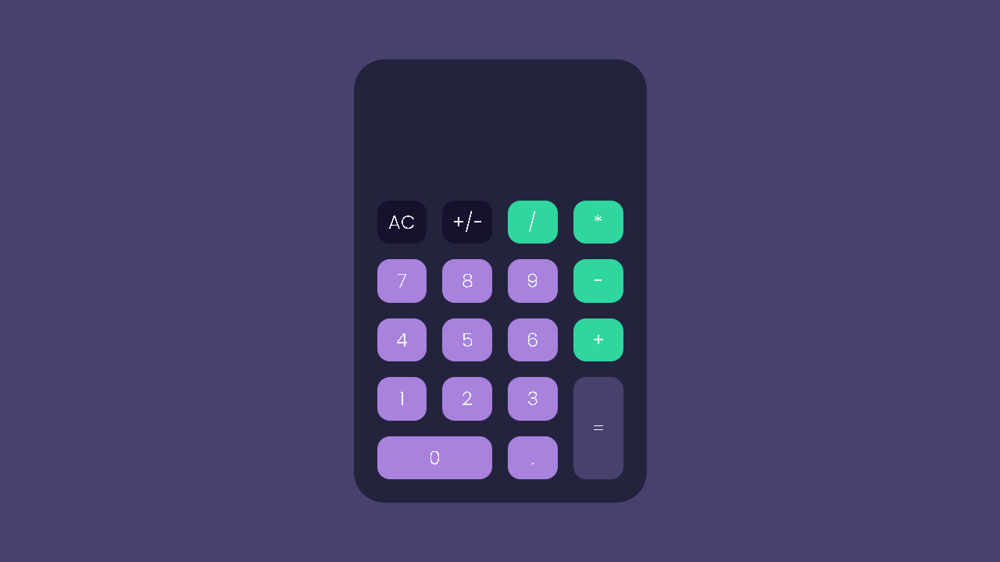

# 🧮 Calculadora Web

Projeto de Calculadora utilizando JavaScript, desenvolvido com o objetivo de treinar funções, manipulação de eventos e estilizações com HTML e CSS.

---

📌 **Funcionalidades principais:**
- Operações básicas: soma, subtração, multiplicação e divisão
- Interface simples e intuitiva
- Exibição dinâmica dos resultados

---

🎨 **Tecnologias utilizadas:**
- HTML5
- CSS3
- JavaScript

---

🚀 **Objetivo do projeto:**
- Praticar a criação de funções em **JavaScript**
- Exercitar manipulação de eventos e DOM
- Aprimorar habilidades de estilização com CSS

---

**📌 Tela inicial**

🌐 **Veja a página online:** [https://juliolds.github.io/Calculadora-JS/index.html](https://juliolds.github.io/Calculadora-JS/index.html)
